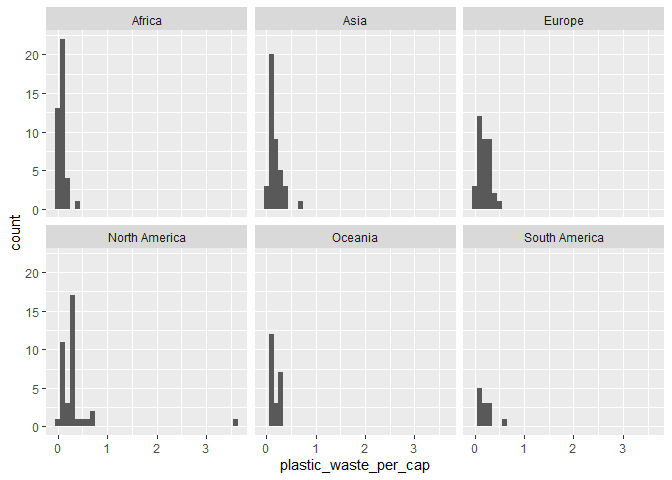

Lab 02 - Plastic waste
================
Saima Arina
01/22/2026

## Load packages and data

``` r
library(tidyverse) 
```

``` r
plastic_waste <- read.csv("data/plastic-waste.csv")
```

## Exercises

### Exercise 1

In terms of their plastic waste per capita, it seems that North America
has the highest, with the Trinidad and Tobago outlier of over 3.5
kg/person and also a skew towards higher numbers. Oceania and South
America share similar distributions. Africa seems to have the lowest,
with most countries below 0.2 kg/person. Asia seems to have a skew
towards the right.

``` r
ggplot(data = plastic_waste, mapping = aes (x = plastic_waste_per_cap)) + geom_histogram (binwidth = 0.1) +
facet_wrap(~ continent)
```

    ## Warning: Removed 51 rows containing non-finite outside the scale range
    ## (`stat_bin()`).

<!-- -->

### Exercise 2

``` r
# insert code here
```

### Exercise 3

Remove this text, and add your answer for Exercise 3 here.

``` r
# insert code here
```

### Exercise 4

Remove this text, and add your answer for Exercise 4 here.

``` r
# insert code here
```

``` r
# insert code here
```

``` r
# insert code here
```

``` r
# insert code here
```

### Exercise 5

Remove this text, and add your answer for Exercise 5 here.

``` r
# insert code here
```
