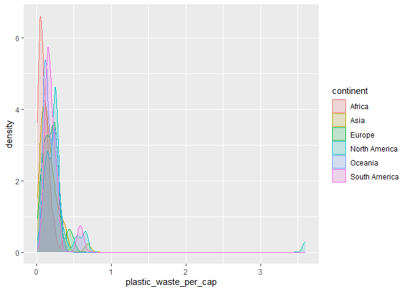
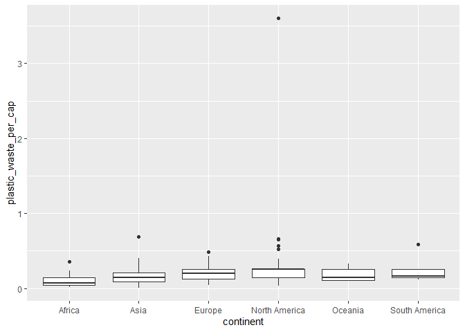
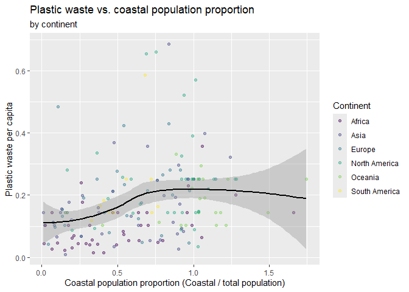

Lab 02 - Plastic waste
================
Saima Arina
01/22/2026

## Load packages and data

``` r
library(tidyverse) 
```

``` r
plastic_waste <- read.csv("data/plastic-waste.csv")
```

## Exercises

### Exercise 1

In terms of their plastic waste per capita, it seems that North America
has the highest, with the Trinidad and Tobago outlier of over 3.5
kg/person and also a skew towards higher numbers. Oceania and South
America share similar distributions. Africa seems to have the lowest,
with most countries below 0.2 kg/person. Asia seems to have a skew
towards the right.

``` r
ggplot(data = plastic_waste, mapping = aes (x = plastic_waste_per_cap)) + geom_histogram (binwidth = 0.1) +
facet_wrap(~ continent)
```

    ## Warning: Removed 51 rows containing non-finite outside the scale range
    ## (`stat_bin()`).

<!-- -->

### Exercise 2

``` r
ggplot(
  data = plastic_waste,
  mapping = aes(
    x = plastic_waste_per_cap,
    color = continent,
    fill = continent,
  )
) +
  geom_density(alpha = 0.175)
```

    ## Warning: Removed 51 rows containing non-finite outside the scale range
    ## (`stat_density()`).

<!-- -->

The color and fill of the curves were defined by mapping aesthetics
because if the info is to be in the legend, it must be a part of this
layer. Also, it allows the colors to scale for each group. The alpha
level is defined as a characteristic of the plotting geom because it is
a element universally applied to all of the groups rather than
differently for them individually.

### Exercise 3

Violin plots are capable of revealing the shape of the distribution,
including peaks and skewness, while box plots provide more information
on quartiles and extreme outliers.

``` r
ggplot(
  data = plastic_waste,
  mapping = aes(
    x = continent,
    y = plastic_waste_per_cap
  )
) +
  geom_boxplot()
```

    ## Warning: Removed 51 rows containing non-finite outside the scale range
    ## (`stat_boxplot()`).

<!-- -->

``` r
ggplot(
  data = plastic_waste,
  mapping = aes(
    x = continent,
    y = plastic_waste_per_cap
    
  )
) +
  geom_violin()
```

    ## Warning: Removed 51 rows containing non-finite outside the scale range
    ## (`stat_ydensity()`).

<!-- -->

### Exercise 4

There is a pretty visible positive linear relationship where higher
total plastic waste per capita is associated with higher amounts of
mismanaged plastic waste per capita, and most points are clustered along
a line that is upwards and there are some high outliers. In terms of
continent, all of the colors seem to flow the same positive trend, with
North America showing prominently high-value outliers. I would say for
the last two plots, that plastic waste per capita and total population
seem to be more strongly linearly associated because more of the data
points are clustered together in the same area while the other plot
measuring coastal population has a greater numbers of outliers and
slightly more spread.

``` r
ggplot(data = plastic_waste,
       mapping = aes(x = plastic_waste_per_cap,  y = mismanaged_plastic_waste_per_cap
                
                     )) +
  geom_point() 
```

    ## Warning: Removed 51 rows containing missing values or values outside the scale range
    ## (`geom_point()`).

<!-- -->

``` r
ggplot(data = plastic_waste,
       mapping = aes(x = plastic_waste_per_cap,  y = mismanaged_plastic_waste_per_cap,
                     color = continent
                     )) +
  geom_point() 
```

    ## Warning: Removed 51 rows containing missing values or values outside the scale range
    ## (`geom_point()`).

<!-- -->

``` r
ggplot(data = plastic_waste, 
       mapping = aes(x = plastic_waste_per_cap, y = total_pop)) + geom_point ()
```

    ## Warning: Removed 61 rows containing missing values or values outside the scale range
    ## (`geom_point()`).

<!-- -->

``` r
ggplot(data = plastic_waste, 
       mapping = aes (x = plastic_waste_per_cap, y = coastal_pop)) + geom_point ()
```

    ## Warning: Removed 51 rows containing missing values or values outside the scale range
    ## (`geom_point()`).

<!-- -->

### Exercise 5

``` r
ex5data = mutate(filter(plastic_waste,plastic_waste_per_cap <= 3),
         coastal_prop = coastal_pop / total_pop) 

  ggplot(data = ex5data,
    aes(
      x = coastal_prop,
      y = plastic_waste_per_cap,
      color = continent
    )
  ) +
  geom_point(alpha = 0.4) +
  geom_smooth(
    method = "loess",
    se = TRUE,
    color = "black"
  ) +
  scale_color_viridis_d() +
  labs(
    title = "Plastic waste vs. coastal population proportion",
    subtitle = "by continent",
    x = "Coastal population proportion (Coastal / total population)",
    y = "Plastic waste per capita",
    color = "Continent"
  ) +
    scale_color_viridis_d()
```

    ## Scale for colour is already present.
    ## Adding another scale for colour, which will replace the existing scale.
    ## `geom_smooth()` using formula = 'y ~ x'

    ## Warning: Removed 10 rows containing non-finite outside the scale range
    ## (`stat_smooth()`).

    ## Warning: Removed 10 rows containing missing values or values outside the scale range
    ## (`geom_point()`).

<!-- -->

I had to look some of this code up, because I got stuck trying to figure
out how to code for things like the regression line and how to do the
shading around it, but then I plugged it into AI and asked it to explain
the code one by one and it makes more sense.

Overall, I see that countries with a moderate share of their population
living in coastal areas tend to have higher plastic waste per capita
than those at either very low or very high coastal proportions, showing
a nonlinear association instead of a more simple straight-line trend. At
low coastal population proportions, plastic waste per capita is
generally sized, then increases as the coastal share rises, before
tapering off again among countries where almost everyone lives near the
coast.
